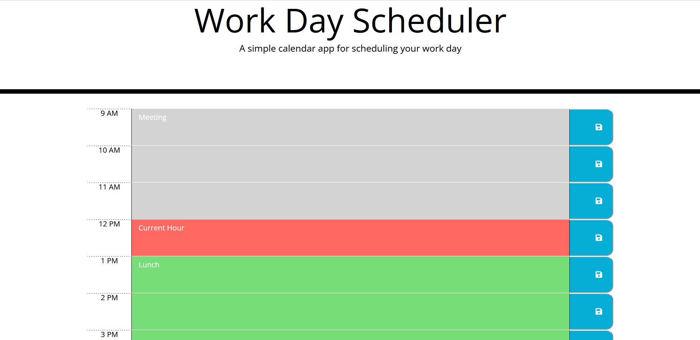

# Work Day Scheduler

## Description

A workday schedule where events can be saved in local storage after being entered on the relevant hour, and all hours are color-coded according to whether they are past (grey), present (red), or future (green).

## Preview 

## Installation

None required

## Usage

Client can use this application to track their daily work schedule.

## License

N/A

## Deployed Page Link
https://cmurphgarv.github.io/Work-Day-Scheduler/
